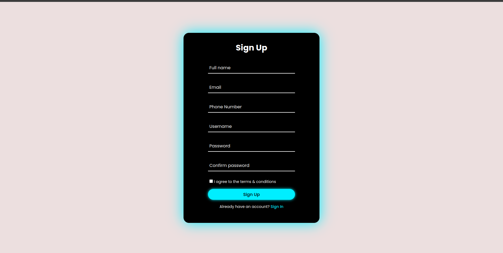

This repository I have created it in order to store my ui templates that I would be using instead of creating new ones all over again. I would start with my project eRehab to use the login and sign up templates in here.
My login page created with only html, css and javascript

Then the signup page

